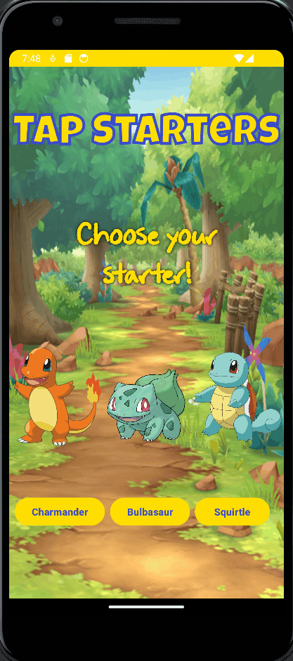

# Android Lab 1 - Tap Starters

Submitted by: Karan Komal

Tap Starters is an android app that recreates a simple idle tapping game, using the thematics of Pokemon. 

Time spent: 5-6 hours spent in total

## Required Features

The following **required** functionality is completed:

- [X] **User can see a number displayed on the screen. The number starts at 0.**
- [X] **User can tap on a button to see the number displayed increase by 1.**

The following **optional** features are implemented:

- [X] User can exchange number of taps accumulated for upgrades. In this app, they are evolutions of the starting pokemon.
  * Base Pokemon starts at 0.
  * First evolution is at 100. This also makes the tap count go up by 2 per tap.
  * Second evolution is at 250. This also makes the tap count go up by 5 per tap.
  * Shiny transformation is at 1000. This also makes the tap count go up by 10 per tap.
- [X] Customize the app with a theme.

The following **additional** features are implemented:

* [X] You can pick between 3 different starting Pokemon.
* [X] Each Pokemon has 2 evolutions and 1 shiny form.
* [X] Theme changes slightly depending on which Pokemon you choose.
* [X] Toasts per Pokemon choosing, evolution, and shiny transformation.

## Video Walkthrough

Here's a walkthrough of implemented features:

<!-- Replace this with whatever GIF tool you used! -->
GIF created with [ScreenToGif](https://www.screentogif.com/) for Windows.
<!-- Recommended tools:
[Kap](https://getkap.co/) for macOS
[ScreenToGif](https://www.screentogif.com/) for Windows
[peek](https://github.com/phw/peek) for Linux. -->

## Notes

Most of the challenges came from the artistic side, but for the most part it was just figuring out where things went and how to size them. I'm sure there is a better way to do this, but I'm satisfied with this as a starting point!

## License

    Copyright 2023 Karan Komal
    
    Licensed under the Apache License, Version 2.0 (the "License");
    you may not use this file except in compliance with the License.
    You may obtain a copy of the License at

        http://www.apache.org/licenses/LICENSE-2.0

    Unless required by applicable law or agreed to in writing, software
    distributed under the License is distributed on an "AS IS" BASIS,
    WITHOUT WARRANTIES OR CONDITIONS OF ANY KIND, either express or implied.
    See the License for the specific language governing permissions and
    limitations under the License.
